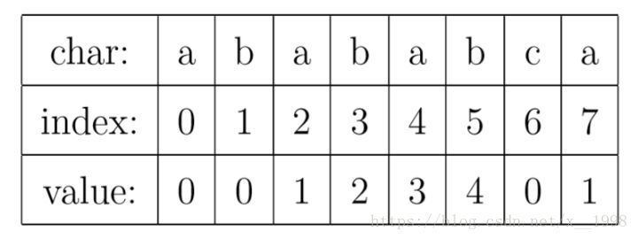
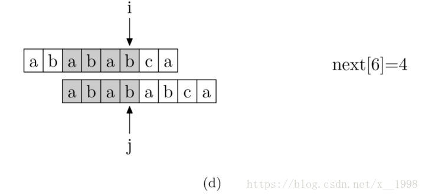

# KMP算法

> [参考博客](https://blog.csdn.net/x__1998/article/details/79951598)

## PMT值

字符串每个的每个位置i都有一个PMT值，这个值表示从0到当前位置的这个子串的**最长的相同的前缀和后缀**，如下表。



例如index3，子串为`"abab"`，其前缀为`{"a", "ab", "aba"}`，后缀为`{"b", "ab", "bab"}`，最长的相同前后缀为`"ab"`，故其PMT值为2。

## KMP核心思想


KMP的核心思想其实很简单，如上图，在a图中，当到达字符串的位置`i`，模式字符串的位置`j`时匹配失败，这时候应该将模式字符串向右移动，移动到哪里呢？

显而易见，应该移动到两个阴影部分重叠，也就是最长的相同的后缀和前缀重合，这就是我们需要PMT值的原因了。

例如该例中的PMT值为4，那么直接令`j = 4`，也就是模式字符串的指针指向了最长前缀的下一个位置，相当于让模式字符串右移，使得公共部分重合，然后就可以继续进行匹配了。

## next数组

其实就是对PMT值移动一下，为了编程的方便而已，本质思想还是没有变。处理如下：

1. `next[0] = -1`
2. PMT整体向后移动，即`next[k] = PMT[k-1]`（k >= 1）。


## next数组的具体求法

除了0位，在任意位置能匹配的最长长度就是当前位置的next。





## Python实现

```python
def getNext(p):
    _next = [0] * (len(p) + 1)
    _next[0] = -1

    i, j = 0, -1
    while i < len(p):
        if j == -1 or p[i] == p[j]:
            i += 1
            j += 1
            _next[i] = j
        else:
            j = _next[j]
    return _next

def KMP(t, p):
    _next = getNext(p)
    i, j = 0
    while i < len(t) and j < len(p):
        if t[i] == p[j]:
            i += 1
            j += 1
        else:
            j = _next[j]
    if j == len(p):
        return i - j
    return -1
```